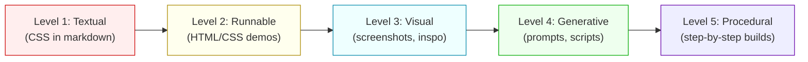

# Visual Design Skills: Asset & Example Requirements

Visual/design skills must **show, not just tell**. A skill that describes an aesthetic purely through prose and CSS snippets inside markdown is incomplete. The agent and the user both need rendered examples, visual references, and procedural walkthroughs that demonstrate the aesthetic in action.

This reference defines the additional requirements for any skill in the `Design & Creative` category that produces visual output: web design skills, shader skills, pixel art skills, visualization skills, UI design skills, and any skill whose output is meant to be seen.

---

## The Visual Skill Completeness Spectrum



**Minimum bar for visual skills: Level 3.** L1 (text-only) is insufficient. L2 (runnable demos) should always be present. L3 (visual references) is required for any aesthetic-specific skill. L4-L5 are the standard for excellent skills.

---

## Required Directory Structure for Visual Skills

```
skill-name/
├── SKILL.md                          # Core process (<500 lines)
├── CHANGELOG.md                      # Version history
├── references/                       # Deep-dive knowledge
│   ├── component-library.md          # CSS/code for components
│   ├── ...                           # Other domain references
│   └── inspiration-sources.md        # Curated gallery with attribution
├── demo/                             # Runnable examples (NEW REQUIREMENT)
│   ├── index.html                    # Primary showcase page
│   ├── components.html               # Component gallery
│   ├── dashboard.html                # Application example
│   └── dark-mode.html                # Dark mode variant
├── assets/                           # Visual reference material (NEW REQUIREMENT)
│   ├── inspiration/                  # Art direction references
│   │   ├── SOURCES.md                # Attribution for all images
│   │   ├── hero-pattern.png          # Key visual patterns
│   │   └── color-study.png           # Color palette references
│   ├── screenshots/                  # Rendered output examples
│   │   ├── landing-light.png         # Light mode landing page
│   │   ├── landing-dark.png          # Dark mode variant
│   │   ├── dashboard.png             # Application UI
│   │   └── components.png            # Component showcase
│   └── before-after/                 # Transformation examples
│       ├── generic-to-styled.png     # Before/after comparison
│       └── anti-pattern-fix.png      # Corrected anti-pattern
├── templates/                        # Starter files (NEW REQUIREMENT)
│   ├── landing-page.html             # Complete starter template
│   ├── dashboard.html                # Application starter
│   └── variables.css                 # Copy-paste token file
├── scripts/                          # Build/generation tools
│   └── generate-palette.py           # Procedural generation
└── prompts/                          # Image generation prompts (NEW)
    ├── nano-banana.md                # Nano Banana prompts + settings
    ├── hero-images.md                # Hero/banner generation prompts
    └── texture-patterns.md           # Background/texture prompts
```

---

## 1. Runnable HTML Demos (`demo/`)

Every visual skill MUST include at least one self-contained HTML file that renders the aesthetic. The demo is the skill's proof of concept — if the agent can't see what the output should look like, it's guessing.

### What Makes a Good Demo

```
┌─────────────────────────────────────────────────┐
│  DEMO REQUIREMENTS                               │
├─────────────────────────────────────────────────┤
│                                                   │
│  ✅ Self-contained (no external dependencies)     │
│  ✅ Inline CSS (no CDN links that may break)      │
│  ✅ Shows 5+ components in context                │
│  ✅ Includes light AND dark mode                  │
│  ✅ Responsive (works on mobile preview)          │
│  ✅ Demonstrates the aesthetic's signature         │
│     elements (the shibboleths, rendered)           │
│  ✅ Includes anti-pattern examples with           │
│     visual comparison (wrong vs right)             │
│                                                   │
│  ❌ No framework dependencies (React, Vue)        │
│  ❌ No build steps required                       │
│  ❌ No images loaded from external URLs            │
│  ❌ No JavaScript required for core styling        │
│                                                   │
└─────────────────────────────────────────────────┘
```

### Demo File Template

```html
<!-- demo/index.html -->
<!-- [Skill Name] Design System Demo -->
<!-- Open this file directly in a browser to see the aesthetic -->

<!DOCTYPE html>
<html lang="en">
<head>
  <meta charset="UTF-8">
  <meta name="viewport" content="width=device-width, initial-scale=1.0">
  <title>[Skill Name] — Design Demo</title>
  <style>
    /* === PASTE THE FULL CSS VARIABLES FROM SKILL.md === */
    :root { /* ... */ }

    /* === PASTE COMPONENT CSS FROM component-library.md === */
    /* ... */

    /* === DEMO-SPECIFIC LAYOUT === */
    .demo-section {
      padding: 4rem 2rem;
      max-width: 1200px;
      margin: 0 auto;
    }
    .demo-section + .demo-section {
      border-top: 1px solid var(--border-color, #eee);
    }
    .demo-grid {
      display: grid;
      grid-template-columns: repeat(auto-fit, minmax(280px, 1fr));
      gap: 1.5rem;
    }

    /* === ANTI-PATTERN COMPARISON === */
    .demo-comparison {
      display: grid;
      grid-template-columns: 1fr 1fr;
      gap: 2rem;
    }
    .demo-wrong { position: relative; opacity: 0.6; }
    .demo-wrong::after {
      content: '✗ WRONG';
      position: absolute; top: 8px; right: 8px;
      background: #dc2626; color: white;
      padding: 2px 8px; font-size: 12px; font-weight: 700;
      border-radius: 4px;
    }
    .demo-right { position: relative; }
    .demo-right::after {
      content: '✓ RIGHT';
      position: absolute; top: 8px; right: 8px;
      background: #16a34a; color: white;
      padding: 2px 8px; font-size: 12px; font-weight: 700;
      border-radius: 4px;
    }
  </style>
</head>
<body>
  <!-- Section 1: Typography Scale -->
  <section class="demo-section">
    <h1>Typography Scale</h1>
    <!-- Show every heading level, body, caption, label, mono -->
  </section>

  <!-- Section 2: Color Palette -->
  <section class="demo-section">
    <h2>Color Palette</h2>
    <!-- Render each color as a swatch with hex and variable name -->
  </section>

  <!-- Section 3: Components -->
  <section class="demo-section">
    <h2>Components</h2>
    <!-- Buttons, cards, inputs, badges, alerts, nav, table -->
  </section>

  <!-- Section 4: Page Layout Example -->
  <section class="demo-section">
    <h2>Page Layout</h2>
    <!-- A realistic mini-page showing the aesthetic in context -->
  </section>

  <!-- Section 5: Anti-Pattern Comparison -->
  <section class="demo-section">
    <h2>Anti-Patterns: Wrong vs Right</h2>
    <div class="demo-comparison">
      <div class="demo-wrong">
        <!-- Show the anti-pattern rendered -->
      </div>
      <div class="demo-right">
        <!-- Show the correct pattern rendered -->
      </div>
    </div>
  </section>

  <!-- Dark mode toggle -->
  <script>
    // Minimal theme toggle for demo
    document.addEventListener('keydown', e => {
      if (e.key === 'd' && e.metaKey) {
        e.preventDefault();
        document.documentElement.toggleAttribute('data-theme-dark');
      }
    });
  </script>
</body>
</html>
```

### Specialty Demo Types

| Skill Category | Required Demo | Format |
|---------------|--------------|--------|
| Web design (CSS-based) | Component gallery + page layout | HTML + inline CSS |
| Shader skills | Live shader preview | HTML + WebGL/Canvas + inline GLSL |
| Pixel art | Rendered examples at 1x and scaled | HTML + inline SVG or data-URI PNGs |
| Data visualization | Chart gallery with sample data | HTML + inline JS (Chart.js/D3 from CDN) |
| 3D / Three.js | Spinning scene preview | HTML + Three.js from CDN |
| Motion / animation | Triggered animation gallery | HTML + CSS animations |

### Shader Demo Template

For shader skills (Metal, GLSL, WebGL), include a WebGL canvas demo:

```html
<!-- demo/shader-preview.html -->
<canvas id="c" style="width:100%;height:400px"></canvas>
<script>
  // Minimal WebGL setup
  const canvas = document.getElementById('c');
  const gl = canvas.getContext('webgl2');
  // ... vertex/fragment shader compilation
  // ... animation loop
</script>
```

For Metal shaders (macOS only), include the GLSL WebGL equivalent for browser preview, with the Metal source in a separate fenced block or file.

---

## 2. Visual References & Inspiration (`assets/`)

### Inspiration Images

Visual skills should include curated reference images showing the aesthetic in the wild. These serve as the agent's "mood board" — visual ground truth for what the output should look like.

**Requirements:**
- 5-15 images showing the aesthetic applied to different contexts
- Include source attribution (artist, URL, license) in `assets/inspiration/SOURCES.md`
- Prefer CC-licensed, public domain, or fair-use educational references
- Include both exemplary applications AND near-miss examples (almost right but not quite)

### SOURCES.md Template

```markdown
# Inspiration Sources

All images in this directory are used for educational reference only.

## Images

| File | Source | Creator | License | Notes |
|------|--------|---------|---------|-------|
| hero-pattern.png | stripe.com | Stripe Inc. | Fair use (educational) | Homepage hero section pattern |
| grid-example.png | linear.app | Linear Inc. | Fair use (educational) | Dashboard grid alignment |
| type-hierarchy.png | vercel.com | Vercel Inc. | Fair use (educational) | Typography scale in action |
| poster-original.jpg | MoMA Collection | Josef Müller-Brockmann | Public domain | 1960 Musica Viva poster |
```

### Screenshots of Rendered Output

After building demos, capture screenshots and include them in `assets/screenshots/`. These serve as visual regression targets — the agent can compare its output against the reference.

### Before/After Comparisons

For each major anti-pattern, include a side-by-side screenshot showing:
- The anti-pattern rendered (what NOT to do)
- The correct pattern rendered (what TO do)

These are more effective than prose descriptions of anti-patterns.

---

## 3. Image Generation Prompts (`prompts/`)

Visual skills should include tested prompts for AI image generation tools. These enable the agent to generate hero images, textures, backgrounds, and visual assets that match the skill's aesthetic.

### Nano Banana Prompts

Structure prompts with the tool's expected format. Include the generation settings that produced good results.

```markdown
# Nano Banana Prompts for [Aesthetic Name]

## Hero Images

### Corporate Landing Hero
**Prompt**: "Minimalist Swiss grid composition, black and white with single
blue accent line, mathematical precision, Müller-Brockmann inspired,
clean typography placeholder blocks, 16:9 aspect ratio, editorial quality"
**Settings**: Style: Photographic, Aspect: 16:9, Quality: HD
**Result notes**: Works best with "editorial" and "precision" keywords.
Avoid "colorful" or "vibrant" — pulls away from Swiss restraint.

### Abstract Grid Pattern
**Prompt**: "Geometric grid pattern, international typographic style,
black lines on white background, asymmetric composition, negative space,
modernist graphic design, vector quality, seamless"
**Settings**: Style: Digital Art, Aspect: 1:1, Quality: HD

### Dashboard Background Texture
**Prompt**: "Subtle dot grid pattern, light gray on white, 8px spacing,
minimalist, technical drawing quality, blueprint feel, clean"
**Settings**: Style: Digital Art, Aspect: 16:9
```

### Prompt Engineering Notes

Include notes on what works and what doesn't for the aesthetic:

```markdown
## Prompt Patterns That Work
- "Swiss international typographic style" → strong signal
- "Müller-Brockmann inspired" → geometric, grid-based
- "editorial quality" → clean, professional
- "mathematical precision" → ordered, aligned
- "negative space" → generous whitespace

## Prompt Patterns to AVOID
- "colorful" → breaks the restrained palette
- "organic" → undermines geometric precision
- "handwritten" → contradicts the typographic discipline
- "retro" → pulls toward 70s/80s nostalgia, not Swiss Modern
- "futuristic" → adds sci-fi elements incompatible with the style
```

---

## 4. Procedural Build Guides

The most valuable content in a visual skill is step-by-step "this is how you make this" knowledge. Not just what the output looks like, but the exact sequence of decisions and code that produces it.

### Procedural Template

For each major artifact the skill produces (a landing page, a dashboard, a component), include a procedural guide:

```markdown
## Building a Swiss Modern Landing Page — Step by Step

### Step 1: Set Up the Grid (5 minutes)
Start with the 12-column container. This is the skeleton everything hangs on.

[code: the exact CSS for the grid]

### Step 2: Establish Typography (3 minutes)
Load Inter variable font. Set the type scale. Define heading styles.

[code: font loading + type scale CSS]

### Step 3: Define the Color Tokens (2 minutes)
Three colors: black, white, one accent. That's it.

[code: CSS variables for the palette]

### Step 4: Build the Hero Section (10 minutes)
The hero is 60% whitespace. The headline is the largest thing on the page.
The CTA is the only colored element.

[code: hero HTML + CSS]
[wireframe: ASCII or screenshot showing the result]

### Step 5: Add the Feature Grid (8 minutes)
Three cards, each spanning 4 of 12 columns. Asymmetric text/image split.

[code: feature grid HTML + CSS]

### Step 6: Dark Mode (5 minutes)
Invert the tokens. Brighten the accent. Verify contrast.

[code: dark mode CSS variables]

### Step 7: Verify Against Checklist
Run through the Quick Test from SKILL.md. Every item should pass.
```

### What "Procedural" Means

| Approach | Quality | Example |
|----------|---------|---------|
| **Declarative** (L1) | Weak | "Use a 12-column grid with generous whitespace" |
| **Descriptive** (L2) | OK | "Set `grid-template-columns: repeat(12, 1fr)` with 24px gutters" |
| **Procedural** (L3) | Good | "Step 1: Create `.grid` with `repeat(12, 1fr)`. Step 2: Set `gap: 1.5rem`. Step 3: Add `max-width: 1200px` and `margin: 0 auto`." |
| **Procedural + Visual** (L4) | Excellent | Same as L3, but after each step, show what the page looks like now (screenshot or ASCII wireframe) |
| **Procedural + Visual + Why** (L5) | Best | Same as L4, but explain WHY each decision (why 12 not 16 columns, why 1200px not 1440px, why auto margins not padding) |

**Target: L4-L5 for primary build guides, L3 minimum for secondary patterns.**

---

## 5. Starter Templates (`templates/`)

Include copy-paste-ready files that give users a working starting point:

| File | Purpose | Requirements |
|------|---------|-------------|
| `variables.css` | Complete CSS custom properties | All tokens, light + dark mode |
| `landing-page.html` | Full landing page starter | Self-contained, responsive, accessible |
| `dashboard.html` | App dashboard starter | Sidebar + main layout, metric cards |
| `tailwind.config.js` | Tailwind configuration | Maps skill tokens to Tailwind utilities |
| `tokens.json` | Design tokens as JSON | For integration with Figma, Style Dictionary |

### Template Quality Bar

Templates are NOT sketches. They must be:
- **Complete**: No TODO comments, no placeholder text (use realistic lorem)
- **Responsive**: Works from 320px to 2560px
- **Accessible**: Passes WAVE/axe audit
- **Dark-mode ready**: Includes theme toggle
- **Self-contained**: No external dependencies (inline everything)

---

## 6. Specialty Assets by Skill Type

### Web Design Skills
- `demo/index.html` — Component gallery
- `demo/landing.html` — Full landing page
- `templates/variables.css` — Design tokens
- `assets/screenshots/` — Rendered output
- `prompts/hero-images.md` — Image generation prompts

### Shader Skills (Metal, GLSL, WebGL)
- `demo/shader-preview.html` — WebGL canvas with live shader
- `shaders/effect-name.frag` — Standalone fragment shaders
- `shaders/effect-name.vert` — Standalone vertex shaders
- `shaders/effect-name.metal` — Metal shader source (if applicable)
- `assets/screenshots/` — Rendered shader output at various parameters
- `references/parameter-guide.md` — What each uniform does, with visual examples

### Pixel Art / Retro Skills
- `demo/gallery.html` — Pixel art rendered at 1x, 2x, 4x scales
- `assets/sprites/` — Example sprite sheets (PNG, indexed color)
- `assets/palettes/` — `.pal` or `.gpl` palette files
- `templates/sprite-sheet.html` — CSS sprite sheet template
- `prompts/pixel-art.md` — Generation prompts for pixel art tools

### 3D / Three.js / React Three Fiber Skills
- `demo/scene.html` — Three.js scene with orbit controls
- `assets/models/` — Example `.glb` models (small, CC-licensed)
- `templates/r3f-scene.tsx` — React Three Fiber starter
- `references/material-guide.md` — PBR material setup with visual examples

### Data Visualization Skills
- `demo/chart-gallery.html` — All chart types with sample data
- `assets/sample-data/` — JSON/CSV datasets for demos
- `templates/chart-component.tsx` — React chart component starter
- `references/color-scales.md` — Accessible color scales with swatches

---

## 7. Attribution Requirements

All visual reference material must include attribution. Even fair-use educational references need sourcing.

**Rules:**
- Every image in `assets/inspiration/` must be listed in `SOURCES.md`
- Include: filename, source URL, creator/organization, license type, usage notes
- Prefer CC-BY, CC0, public domain, or clearly fair-use educational references
- For screenshots of commercial products: note "Fair use (educational reference)"
- Never include copyrighted images without attribution
- Never include images of identifiable individuals without consent notation
- When in doubt, use AI-generated alternatives with the prompts from `prompts/`

---

## 8. Validation Checklist for Visual Skills

Append to the standard skill validation checklist:

```
□ demo/ directory exists with at least one self-contained HTML file
□ Demo renders correctly in browser without build steps
□ Demo shows 5+ components in context
□ Demo includes light AND dark mode
□ Demo includes at least one anti-pattern comparison (wrong vs right)
□ assets/screenshots/ has rendered output examples
□ assets/inspiration/SOURCES.md exists with full attribution
□ templates/ has at least one copy-paste-ready starter file
□ Procedural build guide exists for the primary artifact
□ prompts/ directory exists with tested image generation prompts
□ All embedded code blocks are also available as standalone files
□ Shader code exists as both .md-embedded AND standalone .frag/.vert/.metal files
```

---

## 9. Anti-Patterns for Visual Skills

### Anti-Pattern: CSS-in-Markdown Only

**Novice**: "I wrote all the CSS inside ```css fences in the markdown. Users can copy-paste."
**Expert**: Copy-pasting from markdown introduces encoding errors, loses indentation, and forces users to manually assemble files. Ship the CSS as an actual `.css` file in `templates/` AND show it rendered in `demo/`.
**Instead**: Write the reference in markdown, but also ship `templates/variables.css` and `demo/index.html` as runnable files.

### Anti-Pattern: Describing Visual Output in Prose

**Novice**: "The button has a subtle shadow and rounded corners with a blue accent on hover."
**Expert**: The agent reads this and interprets "subtle," "rounded," and "blue" differently every time. A rendered screenshot or HTML demo removes ambiguity entirely.
**Instead**: Show the button rendered. Include the exact CSS. Include a screenshot. Let the agent see what "subtle" means in this specific context.

### Anti-Pattern: No Visual References

**Novice**: "I described the aesthetic in the anti-patterns section. That's enough."
**Expert**: An aesthetic is defined by what it looks like, not by what it avoids. Without positive visual references, the agent knows what NOT to do but doesn't have a clear target for what TO do.
**Instead**: Include 5-15 curated inspiration images with attribution, showing the aesthetic applied to different contexts (landing page, dashboard, mobile, marketing, documentation).

### Anti-Pattern: Shaders Without Preview

**Novice**: "I included the GLSL code in a markdown file. Users can paste it into ShaderToy."
**Expert**: Shaders are visual — their value is in what they render. A shader without a preview is like a recipe without a photo of the dish.
**Instead**: Include a `demo/shader-preview.html` with a WebGL canvas that runs the shader. Also include `assets/screenshots/` showing the shader output at different parameter values.

### Anti-Pattern: Missing Generation Prompts

**Novice**: "I described the color palette and typography. Users can generate matching images themselves."
**Expert**: Prompt engineering for a specific aesthetic is non-trivial. A prompt that works for neobrutalism fails for Swiss Modern. Tested prompts with notes on what works and what doesn't are reusable expertise.
**Instead**: Include `prompts/` with tested prompts for Nano Banana (or other tools), including settings, result notes, and patterns to avoid.
