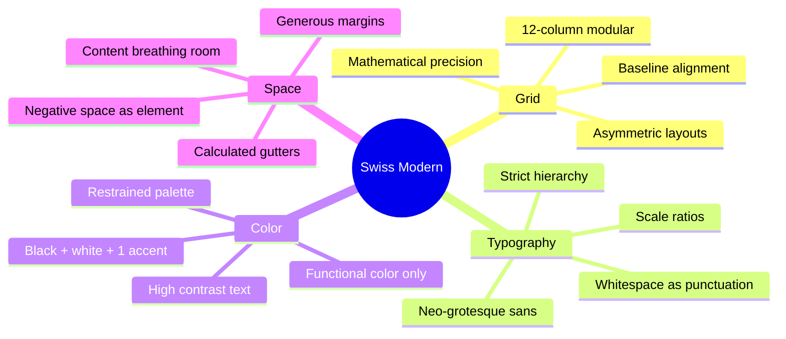

# Swiss Modern Web Designer

Creates modern 2026 web applications with authentic Swiss International Typographic Style. Not recreating 1950s poster design—**extrapolating Müller-Brockmann's mathematical grid principles to modern digital contexts**: SaaS products, developer tools, fintech platforms, and enterprise software that communicates through clarity, not decoration.

## When to Use

**Use for:**
- SaaS dashboards and developer tools (Stripe, Linear, Vercel style)
- Fintech and enterprise platforms requiring trust and precision
- Documentation and content-heavy sites needing clear hierarchy
- Landing pages that sell through clarity, not flash
- Design systems for B2B products
- API documentation and technical portals
- Marketing sites for professional/technical audiences

**Do NOT use for:**
- Bold/raw aesthetic → use **neobrutalist-web-designer** (hard shadows, thick borders)
- Windows retro → use **windows-3-1-web-designer** or **windows-95-web-designer**
- Glassmorphism/blur → use **vaporwave-glassomorphic-ui-designer**
- Decorative/maximalist → use **web-design-expert** with trend guidance
- Playful/friendly → NOT Swiss (consider claymorphism or similar)

## Swiss Modern vs Similar Styles

| Feature | Swiss Modern | Neobrutalism | Glassmorphism | Minimalism |
|---------|-------------|--------------|---------------|------------|
| Grid | **Mathematical, visible** | Loose, intuitive | Flexible | Variable |
| Typography | **Strict hierarchy, scale** | Bold, oversized | Light, clean | Sparse |
| Color | **Restrained, 2-3 max** | Bold primaries | Frosted/pastel | Monochrome |
| Whitespace | **Structural, calculated** | Moderate | Moderate | Abundant |
| Borders | **Hairline or none** | Thick black | Subtle/none | Minimal |
| Shadows | **Minimal or none** | Hard offset | Soft glow | None |
| Philosophy | **Objective clarity** | Raw tension | Ethereal depth | Absence |

---

## Core Design System

### The Four Pillars of Swiss Modern Web Design



### Color Palette

Swiss Modern uses **extreme restraint**. The palette is not decorative—it is functional.

| Color | Hex | CSS Variable | Usage |
|-------|-----|--------------|-------|
| True Black | #000000 | `--swiss-black` | Headlines, primary text |
| Ink | #1a1a1a | `--swiss-ink` | Body text (gentler than black) |
| Charcoal | #404040 | `--swiss-charcoal` | Secondary text |
| Stone | #6b7280 | `--swiss-stone` | Tertiary text, captions |
| Silver | #d1d5db | `--swiss-silver` | Borders, dividers |
| Mist | #f3f4f6 | `--swiss-mist` | Subtle backgrounds |
| Snow | #f9fafb | `--swiss-snow` | Card backgrounds |
| White | #ffffff | `--swiss-white` | Page background |
| Accent | #0066ff | `--swiss-accent` | Links, CTAs, focus (your brand) |
| Accent Hover | #0052cc | `--swiss-accent-hover` | Interactive hover state |

**Dark mode palette:**

| Color | Hex | CSS Variable | Usage |
|-------|-----|--------------|-------|
| Background | #09090b | `--swiss-bg-dark` | Page background |
| Surface | #18181b | `--swiss-surface-dark` | Card backgrounds |
| Elevated | #27272a | `--swiss-elevated-dark` | Raised elements |
| Border | #3f3f46 | `--swiss-border-dark` | Dividers |
| Text Primary | #fafafa | `--swiss-text-dark` | Headlines, primary |
| Text Secondary | #a1a1aa | `--swiss-text-muted-dark` | Body text |
| Accent | #3b82f6 | `--swiss-accent-dark` | Brighter for dark bg |

**Color Rules:**
- ✅ Maximum 3 colors: black, white, one accent
- ✅ Use gray scale for information hierarchy
- ✅ Color communicates function, never decoration
- ✅ Accent color reserved for actionable elements only
- ❌ NO gradients on UI elements (flat, solid fills)
- ❌ NO decorative color blocks without content purpose
- ❌ NO color as primary differentiator between content sections

### The Sacred Grid

**THE defining Swiss element** — mathematical, modular, visible in the output:

```css
.swiss-grid {
  display: grid;
  grid-template-columns: repeat(12, 1fr);
  gap: var(--swiss-gutter);
  max-width: var(--swiss-max-width);
  margin: 0 auto;
  padding: 0 var(--swiss-margin);
}

/* Content spanning patterns */
.swiss-col-full   { grid-column: 1 / -1; }
.swiss-col-wide   { grid-column: 2 / 12; }   /* 10 of 12 */
.swiss-col-content{ grid-column: 3 / 11; }   /* 8 of 12 — reading width */
.swiss-col-narrow { grid-column: 4 / 10; }   /* 6 of 12 — focused content */
.swiss-col-half-l { grid-column: 1 / 7; }    /* Left half */
.swiss-col-half-r { grid-column: 7 / -1; }   /* Right half */
.swiss-col-third  { grid-column: span 4; }   /* One third */
.swiss-col-quarter{ grid-column: span 3; }   /* One quarter */

/* Asymmetric layout (the Swiss signature) */
.swiss-col-sidebar { grid-column: 1 / 4; }   /* 3 of 12 */
.swiss-col-main   { grid-column: 5 / -1; }   /* 8 of 12, column 4 is gutter */
```

### Typography System

Typography is not a component of Swiss design — **it IS Swiss design**.

| Use | Font Stack | Size | Weight | Tracking |
|-----|-----------|------|--------|----------|
| Display | `var(--font-swiss-display)` | 3.5rem+ | 700 | -0.025em |
| H1 | `var(--font-swiss-heading)` | 2.5rem | 600 | -0.02em |
| H2 | `var(--font-swiss-heading)` | 1.75rem | 600 | -0.015em |
| H3 | `var(--font-swiss-heading)` | 1.25rem | 600 | -0.01em |
| Body | `var(--font-swiss-body)` | 1rem | 400 | 0 |
| Small | `var(--font-swiss-body)` | 0.875rem | 400 | 0.01em |
| Caption | `var(--font-swiss-body)` | 0.75rem | 500 | 0.04em |
| Mono | `var(--font-swiss-mono)` | 0.875rem | 400 | -0.02em |
| Label | `var(--font-swiss-body)` | 0.6875rem | 600 | 0.06em |

**Font stacks (free, professional quality):**

```css
:root {
  /* Primary: Inter — the modern Helvetica for screen */
  --font-swiss-display: 'Inter', 'Helvetica Neue', 'Arial', sans-serif;
  --font-swiss-heading: 'Inter', 'Helvetica Neue', 'Arial', sans-serif;
  --font-swiss-body: 'Inter', 'Helvetica Neue', 'Arial', sans-serif;
  --font-swiss-mono: 'JetBrains Mono', 'SF Mono', 'Fira Code', monospace;
}
```

**Alternative stacks for differentiation:**

| Personality | Display Font | Body Font | Pairing Rationale |
|-------------|-------------|-----------|-------------------|
| Technical precision | Space Grotesk | Inter | Geometric + neutral |
| Editorial clarity | Fraunces | Source Serif 4 | Optical + transitional |
| Developer-focused | IBM Plex Sans | IBM Plex Sans | Unified system, mono companion |
| Startup energy | Plus Jakarta Sans | DM Sans | Friendly geometric pair |
| Financial trust | Libre Franklin | Inter | Classic + contemporary |

**Type scale (Perfect Fourth — ratio 1.333):**

```css
:root {
  --swiss-text-xs: 0.75rem;     /* 12px — captions, labels */
  --swiss-text-sm: 0.875rem;    /* 14px — secondary text */
  --swiss-text-base: 1rem;      /* 16px — body */
  --swiss-text-lg: 1.125rem;    /* 18px — lead paragraphs */
  --swiss-text-xl: 1.333rem;    /* ~21px — H4 */
  --swiss-text-2xl: 1.777rem;   /* ~28px — H3 */
  --swiss-text-3xl: 2.369rem;   /* ~38px — H2 */
  --swiss-text-4xl: 3.157rem;   /* ~50px — H1 */
  --swiss-text-5xl: 4.209rem;   /* ~67px — Display */
}
```

### Spacing Scale (8px base, mathematical)

```css
:root {
  --swiss-space-0: 0;
  --swiss-space-1: 0.25rem;   /* 4px */
  --swiss-space-2: 0.5rem;    /* 8px — base unit */
  --swiss-space-3: 0.75rem;   /* 12px */
  --swiss-space-4: 1rem;      /* 16px */
  --swiss-space-5: 1.5rem;    /* 24px */
  --swiss-space-6: 2rem;      /* 32px */
  --swiss-space-7: 2.5rem;    /* 40px */
  --swiss-space-8: 3rem;      /* 48px */
  --swiss-space-9: 4rem;      /* 64px */
  --swiss-space-10: 5rem;     /* 80px */
  --swiss-space-11: 6rem;     /* 96px */
  --swiss-space-12: 8rem;     /* 128px */

  /* Semantic spacing */
  --swiss-gutter: 1.5rem;          /* 24px — grid gutter */
  --swiss-margin: 2rem;            /* 32px — page margin */
  --swiss-section-gap: 6rem;       /* 96px — between sections */
  --swiss-max-width: 1200px;       /* Content max width */
  --swiss-reading-width: 65ch;     /* Optimal line length */
}
```

---

## Modern Extrapolations

### SaaS Dashboard: The Linear Paradigm

Swiss Modern for SaaS is **information clarity through grid discipline**:

- Hairline dividers (1px), not heavy borders
- Typographic hierarchy carries structure (no boxes needed)
- Numbers oversized; labels in small-caps uppercase
- Monochromatic with accent only on actionable elements
- Ample whitespace between data groups

### Landing Page: Selling Through Clarity

- Massive whitespace above and below hero text (96-128px)
- One primary CTA, one text-link secondary
- Headline dominates through size (clamp 2.5-4.2rem), not color
- Social proof is understated (grayscale logos at 40% opacity)
- Content width narrower than grid (8 of 12 columns)

See `references/page-templates.md` for full wireframes and CSS for dashboards, landing pages, documentation sites, pricing pages, about pages, and blog layouts.

### Responsive: Content Reflow, Not Redesign

| Breakpoint | Columns | Gutter | Margin | Behavior |
|-----------|---------|--------|--------|----------|
| <640px | 4 | 16px | 16px | Single column, generous margins |
| 640-1024px | 8 | 24px | 32px | Two-column where meaningful |
| 1024-1440px | 12 | 24px | 48px | Full grid, asymmetric layouts |
| >1440px | 12 | 24px | Auto | Max-width constrains, margins grow |

See `references/grid-system.md` for full responsive CSS implementation.

---

## Component Patterns

Swiss Modern components share these traits: hairline borders (1px), subtle shadows, generous padding, and minimal hover states. For complete CSS implementations of all components, consult `references/component-library.md`.

**Key component rules:**
- **Buttons**: Solid fill (primary) or hairline border (secondary), 6px radius, 150ms transitions
- **Cards**: 1px border, 8px radius, subtle shadow on hover — never hard offset shadows
- **Navigation**: Hairline bottom border, text-sm links, weight change for active state
- **Inputs**: 1px border, accent color + 3px ring on focus, uppercase small labels
- **Tables**: 2px solid header border, 1px row borders, uppercase small-caps column headers
- **Modals**: xl shadow, 12px radius, scale-in animation at 300ms

---

## Anti-Patterns

### Anti-Pattern: Decorative Color

**Novice thinking**: "Each section needs its own background color for visual interest"
**Reality**: Swiss Modern uses whitespace and typography to create hierarchy, not color blocks
**Instead**: Use a single background. Let type size, weight, and spacing do the work.

### Anti-Pattern: Heavy Borders and Shadows

**Novice thinking**: `border: 2px solid #000; box-shadow: 4px 4px 0 #000`
**Reality**: That's neobrutalism. Swiss Modern uses hairline borders (1px) or none at all.
**Instead**: `border: 1px solid var(--swiss-silver)` or rely on whitespace alone

### Anti-Pattern: Tight Spacing

**Novice thinking**: "Whitespace is wasted space—pack the information in"
**Reality**: Whitespace IS the design. Müller-Brockmann's grids were 40%+ empty space.
**Instead**: Double your margins. Then add more. If it feels wasteful, it's getting close.

### Anti-Pattern: Multiple Typefaces

**Novice thinking**: "Display font for headers, body font for text, accent font for callouts"
**Reality**: Swiss design uses ONE typeface family. Hierarchy comes from size and weight, not font switching.
**Instead**: Inter at 700 for heads, 400 for body, 600 for UI. One font, many expressions.

### Anti-Pattern: Rounded Everything

**Novice thinking**: `border-radius: 16px` for a friendly feel
**Reality**: Swiss Modern is precise, not friendly. Small radii (4-8px) or none.
**Instead**: `border-radius: 6px` for subtle softening, `0` for austere precision

### Anti-Pattern: Busy Hover States

**Novice thinking**: Scale transforms, color shifts, shadow additions on hover
**Reality**: Swiss hover states are subtle—a color tint, an underline, a border change
**Instead**: `opacity: 0.8` or `background: var(--swiss-mist)` — minimal, purposeful

### Anti-Pattern: Gradient Text or Backgrounds

**Novice thinking**: `background: linear-gradient(135deg, #667eea 0%, #764ba2 100%)`
**Reality**: Gradients are decoration. Swiss Modern treats color as information.
**Instead**: Solid colors. One accent. Black text on white background. Full stop.

---

## Quick Decision Tree

```
Is it a container element?
├── Card? → 1px border or none, generous padding, no shadow
├── Section? → No border, whitespace separation (96px+ gap)
├── Modal? → Subtle shadow, 1px border, centered
└── Nav? → Bottom border or floating, no background color

Is it interactive?
├── Button? → Solid fill or hairline border, subtle hover
├── Link? → Accent color, underline on hover
├── Input? → 1px border, accent ring on focus
└── Toggle? → Minimal, accent color when active

Is it typography?
├── Display? → Massive size (3.5rem+), tight tracking, max contrast
├── Heading? → Bold weight, negative tracking, clear hierarchy
├── Body? → 16px base, 1.6 line-height, 65ch max width
├── Label? → Small, uppercase, wide tracking, muted color
└── Code? → Monospace, subtle background, smaller size

Is it layout?
├── Full page? → 12-column grid, max-width container, auto margins
├── Content area? → 8 of 12 columns (reading width)
├── Sidebar layout? → 3/9 or 4/8 split, gutter column between
└── Feature grid? → Even columns, generous gutter, aligned baseline
```

---

## CSS Variables Template

Copy-paste the complete variable system from `references/component-library.md`. The essentials:

```css
:root {
  /* Color */
  --swiss-black: #000000;  --swiss-ink: #1a1a1a;
  --swiss-charcoal: #404040;  --swiss-stone: #6b7280;
  --swiss-silver: #d1d5db;  --swiss-mist: #f3f4f6;
  --swiss-snow: #f9fafb;  --swiss-white: #ffffff;
  --swiss-accent: #0066ff;

  /* Typography: Inter, one family */
  --font-swiss: 'Inter', 'Helvetica Neue', 'Arial', sans-serif;
  --font-swiss-mono: 'JetBrains Mono', 'SF Mono', monospace;

  /* Scale: Perfect Fourth (1.333) */
  --swiss-text-base: 1rem;  --swiss-text-4xl: 3.157rem;

  /* Layout */
  --swiss-gutter: 1.5rem;  --swiss-max-width: 1200px;
  --swiss-reading-width: 65ch;  --swiss-section-gap: 6rem;

  /* Motion */
  --swiss-ease: cubic-bezier(0.25, 0.1, 0.25, 1);
  --swiss-duration-normal: 150ms;
}
```

Full variables including dark mode: see `references/component-library.md` and `references/dark-mode.md`.

---

## The Quick Test

If your component has:
- ❌ More than 3 colors in the palette → NOT Swiss Modern
- ❌ Borders thicker than 1px → NOT Swiss Modern (likely neobrutalism)
- ❌ Hard offset shadows → NOT Swiss Modern (that's neobrutalism)
- ❌ Multiple typeface families → NOT Swiss Modern
- ❌ Decorative elements without function → NOT Swiss Modern
- ❌ Tight, cramped spacing → NOT Swiss Modern
- ❌ Gradients on UI elements → NOT Swiss Modern

It should have:
- ✅ Mathematical grid alignment (content snaps to columns)
- ✅ Strict typographic hierarchy (clear size/weight steps)
- ✅ Generous, calculated whitespace (40%+ of viewport)
- ✅ One typeface family, many weights
- ✅ Restrained color (black + white + one accent)
- ✅ Hairline borders or whitespace separation
- ✅ Subtle, purposeful hover states
- ✅ Content-first, decoration-absent

---

## Accessibility

Swiss Modern is inherently accessibility-friendly when done right:

1. **High contrast** — Black on white exceeds WCAG AAA (21:1 ratio)
2. **Clear hierarchy** — Size and weight steps are unambiguous
3. **Readable measure** — 65ch line length matches reading research
4. **Focus states** — Accent color ring provides clear focus indication
5. **Reduced motion** — Subtle transitions degrade gracefully

```css
@media (prefers-reduced-motion: reduce) {
  * {
    transition-duration: 0.01ms !important;
    animation-duration: 0.01ms !important;
  }
}

.swiss-button:focus-visible {
  outline: 2px solid var(--swiss-accent);
  outline-offset: 2px;
}

.swiss-input:focus-visible {
  border-color: var(--swiss-accent);
  box-shadow: 0 0 0 3px rgba(0, 102, 255, 0.15);
}
```

---

## References

- `references/component-library.md` — Full CSS for all Swiss Modern components (tables, modals, badges, etc.)
- `references/grid-system.md` — Müller-Brockmann grid theory translated to CSS Grid, with responsive patterns
- `references/typography-guide.md` — Deep dive on type scales, font pairings, OpenType features, and variable fonts
- `references/page-templates.md` — Complete page layouts (landing, dashboard, docs, pricing, about)
- `references/dark-mode.md` — Swiss Modern dark mode: palette inversion, contrast ratios, and implementation

---

## Pairs With

- **typography-expert** — For advanced type pairing and OpenType feature guidance
- **design-system-creator** — For generating full three-tier token architectures
- **design-system-generator** — Generate Swiss Modern tokens via `swiss-modern` trend preset
- **web-design-expert** — For brand direction alongside Swiss principles
- **color-contrast-auditor** — Verify accessibility with the restrained palette

---

## Sources

Design principles rooted in:
- Josef Müller-Brockmann, *Grid Systems in Graphic Design* (1981)
- Emil Ruder, *Typographie* (1967)
- Jan Tschichold, *The New Typography* (1928)
- Massimo Vignelli, *The Vignelli Canon* (2010)
- Modern implementations: Stripe.com, Linear.app, Vercel.com, Resend.com
