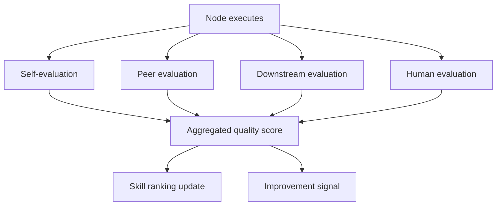
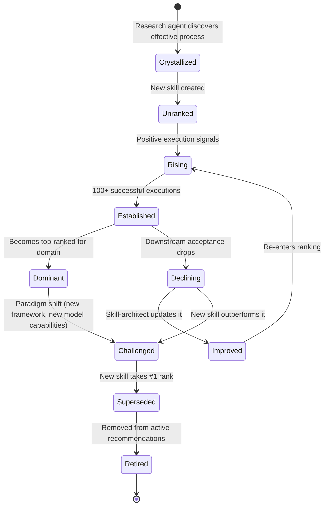
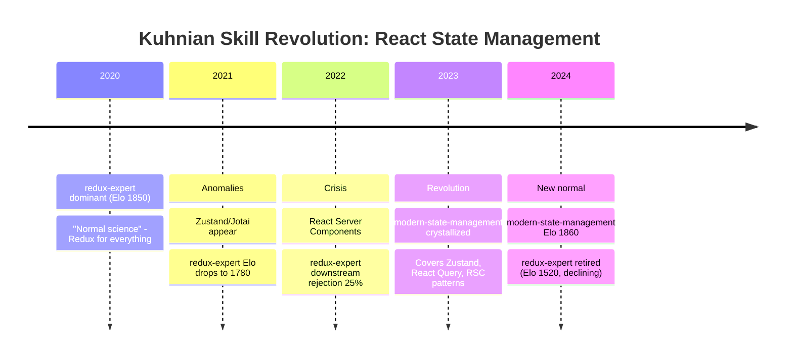
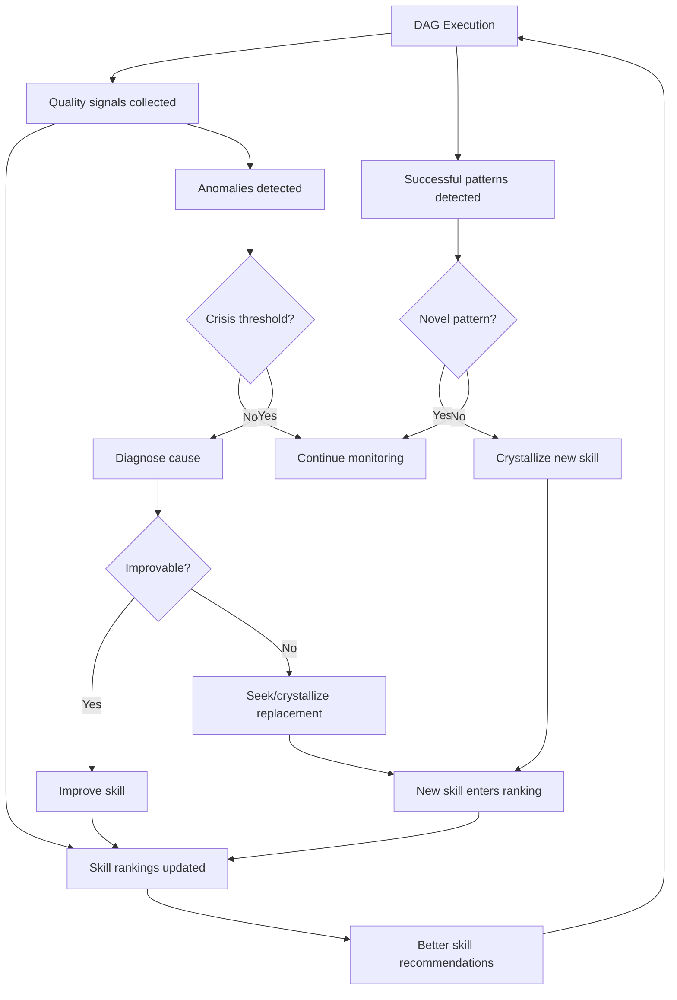

# Skill Lifecycle: Self-Evaluation, Ranking, and Kuhnian Revolution

How winDAGs uses execution data to create, improve, retire, and supersede skills automatically. Includes the multi-evaluator architecture (self-scoring, peer-scoring, downstream-scoring, human-scoring) and the Kuhnian paradigm shift model for skill evolution.

---

## The Four Evaluators

Your question — "Can agents score their own responses, or a Haiku agent evaluate them, or downstream agents?" — has a nuanced answer: **all four, and they each catch different failures.**



### Evaluator 1: Self-Evaluation (The Agent Grades Itself)

**How**: After producing output, the agent runs a self-check against the skill's QA checklist and output contract.

**Model**: Use the SAME model that produced the output (no extra cost for a separate call — just append "Now evaluate your output against these criteria" to the same conversation). Or, for cheaper self-eval, use a Haiku call with the output + checklist.

```python
SELF_EVAL_PROMPT = """
You just produced the following output for the task "{task}".

Output:
{output}

Evaluate your own work on these dimensions (0.0 to 1.0):
1. Completeness: Does the output address all parts of the task?
2. Contract compliance: Does it match the required output schema?
3. Confidence: How confident are you in the correctness?
4. Skill adherence: Did you follow the skill's steps in order?

Return JSON: {{"completeness": 0.X, "contract": 0.X, "confidence": 0.X, "adherence": 0.X, "overall": 0.X, "concerns": ["..."]}}
"""
```

**What it catches**: Contract violations, obvious omissions, cases where the agent knows it's uncertain.

**What it misses**: Self-evaluation has a **sycophancy bias** — models tend to rate their own output higher than warranted. Calibration varies by model: Opus self-evaluates more accurately than Haiku. Self-scores should be weighted ~0.3x compared to downstream/human scores.

**Cost**: ~$0.001 if using Haiku, ~$0 if appended to the same conversation.

### Evaluator 2: Peer Evaluation (A Different Agent Grades It)

**How**: A separate, dedicated evaluator agent (a "judge node") reviews the output using the skill-grader skill. The judge should be a different model or at least a different conversation to avoid self-serving bias.

```python
async def peer_evaluate(output: dict, task: str, skill_used: str) -> dict:
    """Dedicated judge agent evaluates output quality."""
    return await execute_with_model(
        model='claude-haiku-3.5',  # Cheap judge
        system=load_skill('skill-grader'),
        prompt=f"""
        Task: {task}
        Skill used: {skill_used}
        Output to evaluate:
        {json.dumps(output)}
        
        Grade this output on the 10 axes. Return the grading report.
        """,
    )
```

**What it catches**: Logical errors the producing agent can't see, skill misapplication, quality issues that require a fresh perspective.

**What it misses**: May not understand domain context as well as the producing agent. Can be fooled by confident-sounding but incorrect output.

**Cost**: ~$0.001-0.003 per evaluation (Haiku). Worth it for any node whose output feeds a human gate or final deliverable.

**Key insight**: A Haiku judge with the skill-grader skill is surprisingly effective. The rubric is mechanical enough that even a cheap model can follow it accurately. You're paying for the SKILL's structure, not the model's reasoning.

### Evaluator 3: Downstream Evaluation (The Next Node Grades It)

**How**: The downstream node, when it receives input from upstream, evaluates whether that input is usable before starting its own work. This is the most natural evaluation because it happens automatically as part of DAG execution.

```python
DOWNSTREAM_EVAL_PROMPT = """
You are about to begin your task: {downstream_task}

You received this input from the upstream node ({upstream_role}):
{upstream_output}

Before starting, evaluate the input:
1. Is it structurally valid? (matches expected schema)
2. Is it complete? (has all fields you need)
3. Is it plausible? (no obvious errors or contradictions)
4. Is it useful? (does it actually help with your task)

Return JSON: {{"valid": true/false, "complete": true/false, "plausible": true/false, "useful": true/false, "issues": ["..."]}}

If all four are true, proceed with your task.
If any is false, report the issue and request re-execution.
"""
```

**What it catches**: Contract mismatches, incomplete data, outputs that are technically valid but functionally useless for the next step. This is the **strongest signal** because it measures real utility, not abstract quality.

**What it misses**: Subtle quality issues that don't manifest until much later in the pipeline. A downstream node may accept mediocre input if it can work around it.

**Cost**: ~$0 if embedded in the downstream node's prompt as a preamble. The evaluation happens as part of the downstream node's normal reasoning.

### Evaluator 4: Human Evaluation (The Gold Standard)

**How**: At human-in-the-loop gates, the human's decision (approve / reject / modify) is the highest-fidelity quality signal.

**What it catches**: Everything the other three miss. Subjective quality, domain correctness, alignment with actual user intent, taste.

**What it misses**: Nothing — but it's expensive (human time) and slow.

**Cost**: Human time. Only use at gates where it matters (final deliverables, irreversible actions, high-stakes decisions).

### Aggregating the Four Scores

```python
def aggregate_quality(
    self_score: float | None,
    peer_score: float | None,
    downstream_accepted: bool | None,
    human_approved: bool | None,
) -> float:
    """Weighted aggregate of all available quality signals."""
    scores = []
    
    if self_score is not None:
        scores.append((self_score, 0.15))       # Low weight: sycophancy bias
    if peer_score is not None:
        scores.append((peer_score, 0.25))        # Medium weight: fresh perspective
    if downstream_accepted is not None:
        scores.append((1.0 if downstream_accepted else 0.3, 0.35))  # High weight: real utility
    if human_approved is not None:
        scores.append((1.0 if human_approved else 0.0, 0.50))       # Highest weight: gold standard
    
    if not scores:
        return 0.5  # No signal
    
    # Normalize weights to sum to 1.0
    total_weight = sum(w for _, w in scores)
    return sum(s * w for s, w in scores) / total_weight
```

Weights reflect trust hierarchy: **human > downstream > peer > self**.

---

## Skill Ranking System

### Elo-Based Skill Ranking

Borrow from Chatbot Arena's Elo system. Every skill execution is a "match" against the task. Win = quality score ≥ 0.8. Loss = quality score < 0.5. Draw = in between.

```python
def update_skill_elo(skill_name: str, quality_score: float, domain: str):
    """Update skill's Elo rating based on execution outcome."""
    current_elo = get_skill_elo(skill_name, domain)
    
    # Expected score based on current rating
    expected = 1.0 / (1.0 + 10 ** ((1500 - current_elo) / 400))
    
    # Actual score (continuous, not binary)
    actual = quality_score
    
    # K-factor: higher for new skills (more volatile), lower for established
    executions = get_execution_count(skill_name, domain)
    k = 32 if executions < 50 else 16 if executions < 200 else 8
    
    new_elo = current_elo + k * (actual - expected)
    set_skill_elo(skill_name, domain, new_elo)
```

### Multi-Dimensional Ranking

A single Elo isn't enough. Rank skills on multiple axes:

| Axis | Signal | Weight |
|------|--------|--------|
| **Effectiveness** | Downstream acceptance rate | 30% |
| **Efficiency** | Enables model downgrading (works on Haiku?) | 20% |
| **Reliability** | Contract compliance rate | 20% |
| **Cost** | Average token usage when loaded | 15% |
| **Freshness** | Last updated, temporal markers present | 15% |

### Skill Leaderboard

```
Domain: Code Review
━━━━━━━━━━━━━━━━━━━━━━━━━━━━━━━━━━━━━━━━━━━━━━
#1  code-review-skill         Elo: 1847  ▲  Executions: 2,341
#2  react-server-components   Elo: 1723  ▲  Executions: 891  
#3  typescript-strict-mode    Elo: 1698  ─  Executions: 456
#4  testing-patterns          Elo: 1612  ▼  Executions: 234
#5  legacy-code-reviewer      Elo: 1489  ▼  Executions: 89   ⚠️ DECLINING
```

---

## Skill Lifecycle: Creation → Improvement → Revolution

### The Full Lifecycle



### Phase 1: Crystallization (Birth)

A new skill is born when:
- A research agent discovers an effective process for a novel domain
- A user contributes a skill from their own expertise
- The meta-DAG's evaluator notices a recurring pattern across successful executions

```python
async def crystallize_skill_from_execution(
    successful_dag: dict,
    node_id: str,
    execution_trace: dict,
) -> str:
    """Extract a new skill from a successful DAG execution."""
    
    node = find_node(successful_dag, node_id)
    trace = execution_trace[node_id]
    
    # Use Opus to extract the process that worked
    skill_draft = await execute_with_model(
        model='claude-opus-4',
        system=load_skill('skill-architect'),
        prompt=f"""
        This DAG node succeeded without a pre-built skill. Extract the process
        it used into a reusable skill.
        
        Node role: {node['agent']['role']}
        Task: {trace['task']}
        Approach taken: {trace['reasoning']}
        Output produced: {trace['output']}
        Downstream acceptance: {trace['downstream_accepted']}
        
        Create a SKILL.md following the skill-architect template.
        Include: When to Use, NOT for, Core Process (numbered steps),
        Anti-Patterns (at least 1), Output Contract.
        """,
    )
    
    return skill_draft
```

### Phase 2: Ranking (Growth)

New skills start unranked. Every execution generates quality signals. After ~50 executions, the ranking stabilizes. After ~200, the skill is "established" — its Elo reflects real-world performance.

### Phase 3: Improvement (Maintenance)

When a skill's ranking starts declining:

1. **Automated diagnosis**: Which axis is declining? Effectiveness? Reliability? Freshness?
2. **Improvement suggestions**: The skill-grader runs a full audit and produces specific recommendations
3. **Automated or human improvement**: Either a Sonnet agent with skill-architect applies the fixes, or a human skill maintainer does

```python
async def diagnose_declining_skill(skill_name: str, domain: str) -> dict:
    """Identify why a skill's ranking is declining."""
    recent_executions = get_recent_executions(skill_name, domain, limit=50)
    
    failure_patterns = analyze_failures(recent_executions)
    # e.g., "downstream_rejection_rate increased from 5% to 22% in last 30 days"
    # e.g., "contract_violation on 'recommendations' field in 15% of executions"
    # e.g., "self_score high but downstream_score low = sycophancy drift"
    
    return {
        "skill": skill_name,
        "domain": domain,
        "declining_axes": failure_patterns,
        "suggested_improvements": generate_improvements(failure_patterns),
        "urgency": "high" if failure_patterns["effectiveness_drop"] > 0.15 else "medium",
    }
```

### Phase 4: Kuhnian Revolution (Paradigm Shift)

This is the genuinely novel idea. Thomas Kuhn's model of scientific revolutions applies to skills:

**Normal science** = Skills operate within a stable paradigm (e.g., "React uses class components for state management"). The skill works, rankings are stable, everyone uses it.

**Anomalies accumulate** = The world changes (React 16.8 introduces Hooks). The existing skill starts producing advice that downstream nodes reject more often. Ranking declines. But no single failure is dramatic enough to trigger replacement.

**Crisis** = The anomaly rate crosses a threshold. The skill's Elo drops below a "crisis threshold." The system flags it for review.

**Revolution** = A new skill is crystallized (from research, from a user, from successful improvisation) that addresses the new paradigm. It enters the ranking. If it outperforms the incumbent over ~100 executions, it supersedes it.

**New normal science** = The new skill becomes dominant. The old skill is deprecated with a temporal marker ("Pre-React 16.8: this skill. Post-React 16.8: use hooks-expert instead.").



### Automated Revolution Detection

```python
def detect_paradigm_shift(domain: str) -> list[dict]:
    """Detect skills undergoing Kuhnian crisis."""
    skills = get_skills_for_domain(domain)
    crises = []
    
    for skill in skills:
        # Get rolling 30-day metrics
        recent = get_metrics(skill, days=30)
        historical = get_metrics(skill, days=180)
        
        # Anomaly detection: is effectiveness dropping significantly?
        effectiveness_delta = recent.effectiveness - historical.effectiveness
        rejection_rate_delta = recent.downstream_rejection - historical.downstream_rejection
        
        if effectiveness_delta < -0.15 or rejection_rate_delta > 0.10:
            # Check if a challenger exists
            challengers = find_rising_skills(domain, min_elo_delta=50, days=30)
            
            crises.append({
                "skill": skill.name,
                "domain": domain,
                "crisis_severity": abs(effectiveness_delta),
                "rejection_rate_increase": rejection_rate_delta,
                "challengers": [c.name for c in challengers],
                "recommendation": (
                    "SUPERSEDE" if challengers else
                    "IMPROVE" if effectiveness_delta > -0.25 else
                    "RETIRE"
                ),
            })
    
    return crises
```

---

## The Feedback Loop: DAG Execution → Skill Evolution

Every DAG execution contributes to skill evolution:



### What This Means for winDAGs as a Product

The skill lifecycle is the **core differentiator**:
- Every execution makes the system smarter (data network effect)
- Skills self-improve or get replaced (quality ratchet)
- The marketplace surfaces the best skills automatically (curation at scale)
- Temporal knowledge stays current because stale skills get detected and flagged (anomaly detection)
- Users don't need to be skill experts — the system tells them which skills are working

No other agent platform has this. LangGraph has tools. CrewAI has roles. But nobody has a ranked, self-improving, self-evaluating skill ecosystem where the library gets better every time someone runs a DAG.

---

## Evaluation Architecture Recommendations

### For Every Node (Cheap, Always-On)
- Self-evaluation: appended to the same conversation, ~$0 extra
- Downstream evaluation: embedded in the next node's preamble, ~$0 extra

### For Important Nodes (Moderate Cost)
- Peer evaluation via Haiku + skill-grader: ~$0.001-0.003
- Use for: any node feeding a human gate, final deliverable nodes, nodes with high failure rates

### For Human Gates (Expensive, High-Fidelity)
- Human approval/rejection: highest-quality signal
- Use for: irreversible actions, high-stakes decisions, final outputs

### For Skill Ranking (Batch, Background)
- Aggregate all signals across executions
- Update Elo ratings in batch (hourly or daily)
- Run anomaly detection weekly
- Flag skills in crisis for review

### Research That Would Improve This

| Topic | Value | Suggested Query |
|-------|-------|----------------|
| LLM-as-judge calibration | High | "How do LLM-as-judge systems calibrate self-evaluation scores? What are the biases? How do LMSYS, AlpacaEval, and MT-Bench handle judge reliability?" |
| Skill marketplace economics | Medium | "What are the business models for developer tool marketplaces? How do VS Code extensions, npm packages, and Terraform modules achieve network effects?" |
| Anomaly detection for model drift | Medium | "How do ML monitoring systems detect concept drift and model degradation in production? Patterns from Evidently AI, WhyLabs, Arize." |
