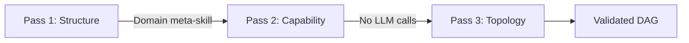
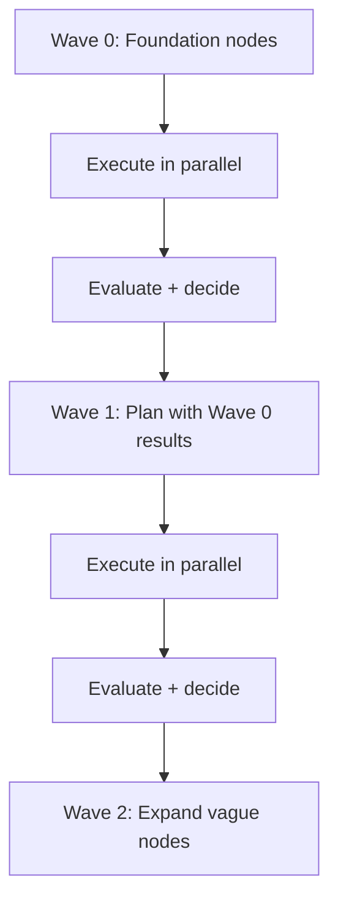
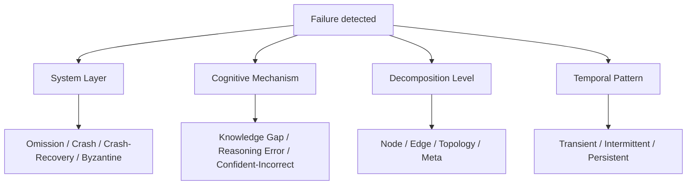
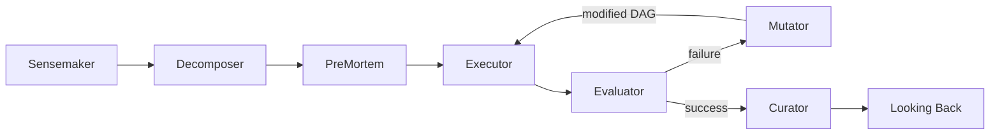

# WinDAGs Architect — V3

Build WinDAGs: directed acyclic graphs of skillful agents that accumulate genuine expertise. Each node is an agent with curated skills; each edge is a typed dependency. The system builds DAGs, executes them in waves, mutates them at runtime, evaluates quality across four layers, and crystallizes reusable skills from execution data.

**For WHY decisions were made** (ADR provenance, tradition attribution, constitutional details): use `windags-avatar`.

---

## When to Use

✅ **Use for**:
- Designing DAG architectures for complex problems
- Implementing execution engines (local, web, embedded)
- Building the meta-DAG (agents that orchestrate other agents)
- Making DAGs dynamic (mutation, vague nodes, wave planning)
- Implementing the four-layer quality model
- Adding human-in-the-loop control structures
- Choosing and implementing DAG visualization

❌ **NOT for**:
- Understanding constitutional decisions (use `windags-avatar`)
- Creating individual skills (use `skill-architect`)
- Rendering static diagrams (use `mermaid-graph-renderer`)

---

## Architecture Overview

```
┌───────────────────────────────────────────────┐
│              User Interface                    │
│  Progressive Disclosure: L1 | L2 | L3          │
│  Four views: Graph | Timeline | Hierarchy | Detail │
├───────────────────────────────────────────────┤
│               Meta-DAG Layer                   │
│  Sensemaker → Decomposer → [PreMortem]         │
│  → Executor → Evaluator → [Mutator]            │
│  → [Curator] → Looking Back                    │
├───────────────────────────────────────────────┤
│             Execution Engine                   │
│  Wave-by-wave | Topological scheduling          │
│  Failure domain isolation | Expediter function  │
│  Circuit breakers (node, skill, model)          │
├───────────────────────────────────────────────┤
│            Evaluation Engine                   │
│  Stage 1: Contract (cheap, always runs)         │
│  Stage 2: Cognitive (deep, conditional)         │
│  Four layers: Floor | Wall | Ceiling | Envelope │
├───────────────────────────────────────────────┤
│             Learning Engine                    │
│  Thompson sampling | Elo ranking                │
│  Method-level tracking | Kuhnian crisis detect  │
│  Monster-barring | Near-miss logging            │
├───────────────────────────────────────────────┤
│          LLM Abstraction Layer                 │
│  Provider Router | Capability Schema            │
│  Cost Tracker | Model failover                  │
├───────────────────────────────────────────────┤
│            Knowledge Library                   │
│  Skills | Methods | Templates | Meta-Skills     │
│  Domain classifiers | Failure patterns          │
└───────────────────────────────────────────────┘
```

---

## Core Concepts

### Three-Pass Decomposition (ADR-001)

Every problem goes through three passes:



- **Pass 1 (Structure)**: Problem → task hierarchy using domain meta-skill. Produces nodes with commitment levels (COMMITTED/TENTATIVE/EXPLORATORY).
- **Pass 2 (Capability)**: Task hierarchy → skill matching. Zero LLM calls — uses signature compatibility + Thompson sampling.
- **Pass 3 (Topology)**: DAG → failure domain isolation, cascade depth scoring, wave assignment.

### Vague Nodes (Principle 9: Progressive Revelation)

Nodes that are known to be needed but not yet fully specified:

```typescript
interface VagueNode {
  id: NodeId;
  role_description: string;    // REQUIRED: what this node does
  dependency_list: NodeId[];   // REQUIRED: what it depends on
  // No agent config, no skill assignment, no model selection
  // These are resolved when the wave containing this node is planned
}
```

Wave N is planned only after Wave N-1 completes (unless recognition &gt;= 0.9). This is the key mechanism that reduces cascading task failure from 34.78% to 4.35%.

### Wave-by-Wave Execution



Within each wave: parallel execution respecting failure domain isolation (BC-PLAN-003: no shared-failure-domain nodes in same batch).

### Skill Selection Cascade (ADR-007)

Five-step cascade for choosing which skill a node uses:

| Step | Type | What | Eliminated |
|------|------|------|-----------|
| 1. Signature | Hard filter | Output schema compatible? | ~70% |
| 2. Context | Hard filter | Context conditions met? | ~15% |
| 3. Relevance | Soft ranking | Domain + output type match | Ranked |
| 4. Recognition | Fast path | Pattern confidence &gt;= 0.8? | Skip to selection |
| 5. Thompson | Explore/exploit | Beta-distribution sampling | Final pick |

### Four-Layer Quality Model (ADR-009)

Every node's output is evaluated across four layers:

| Layer | Question | Type | Cost |
|-------|----------|------|------|
| **Floor** | Did it satisfy the contract? | Binary | Cheap |
| **Wall** | Does it fit the context? | Binary/graded | Cheap |
| **Ceiling** | Did it reason well? (process evaluation) | Graded | Expensive |
| **Envelope** | How stressed was execution? | Deterministic metrics | Zero |

Stage 1 review (Floor + Wall) runs on every node. Stage 2 (Ceiling) is conditional: `estimateFailureProbability(node) × downstreamWaste(node) > reviewCost`.

### Four-Dimensional Failure Classification (ADR-014)



System layer classification always runs. Other dimensions activate at L2+. Each dimension triggers distinct response channels.

### Escalation Ladder

When a failure occurs, the system follows a five-level ladder:

1. **Fix node** — Retry with different prompt/model
2. **Diagnose structure** — Check if the failure is structural (edge/topology)
3. **Generate alternative** — Propose a different decomposition path
4. **Fix topology** — Restructure the DAG (add/remove/replace nodes)
5. **Escalate to human** — Present the situation with full context

---

## Execution Engines

### Process Model (workgroup-ai)

The existing workgroup-ai codebase provides three executors:

| Executor | Isolation | Parallelism | Token Overhead | Use Case |
|----------|-----------|-------------|----------------|----------|
| **ProcessExecutor** | OS process | True parallel | Zero | Default for most workflows |
| **WorktreeExecutor** | Git worktree | True parallel + merge safety | Zero | Code generation needing file isolation |
| **TaskToolExecutor** | Claude Task tool | Limited | 20k/task | Needs conversation context |

### Node Definition (TypeScript)

```typescript
const dag = builder('refactor-codebase')
  .skillNode('analyze', 'code-review-skill')
  .skillNode('plan', 'refactoring-surgeon')
    .dependsOn('analyze')
  .skillNode('execute', 'fullstack-debugger')
    .dependsOn('plan')
  .approvalGate('review', {
    prompt: 'Approve refactor?',
    options: [
      { id: 'approve', label: 'Approve', action: 'approve' },
      { id: 'revise', label: 'Needs revision', action: 'revise', branchTo: 'plan' }
    ]
  }).dependsOn('execute')
  .done();
```

### Edge Protocol Types (ADR-008)

| Protocol | Use When | Default? |
|----------|----------|----------|
| **data-flow** | Node A produces output Node B consumes | Yes (~80%) |
| **contract** | Formal input/output schema enforcement | Phase 2 |
| **request** | Node A asks Node B for on-demand computation | Phase 2 |
| **subscription** | Node A monitors Node B's state changes | Phase 3 |
| **auction** | Multiple nodes bid for a task | Phase 3 |

---

## The Meta-DAG

The meta-DAG is the fixed topology of agents that orchestrate user DAGs:



| Agent | Model Tier | Key Behavioral Contracts |
|-------|-----------|--------------------------|
| **Sensemaker** | Tier 2 (Sonnet) | BC-DECOMP-001: Halt when validity &lt; 0.6 |
| **Decomposer** | Tier 2 (Sonnet) | BC-DECOMP-002: Three passes in order, Pass 2 zero LLM |
| **PreMortem** | Tier 1 (Haiku) | BC-PLAN-004: Lightweight scan on every DAG |
| **Evaluator** | Tier 1→2 | BC-EVAL-001: Floor before Wall before Ceiling |
| **Mutator** | Tier 1 (Haiku) | BC-FAIL-002: Escalation ladder in order |
| **Curator** | Tier 1 (Haiku) | BC-LEARN-005: Monster-barring on every skill revision |
| **Looking Back** | Tier 1→2 | BC-LEARN-003: Q1-Q2 mandatory, Q3-Q4 conditional |

The Executor is **infrastructure, not an LLM agent** (BC-EXEC-006). It runs Kahn's algorithm, manages batches, enforces protocol state machines, and monitors cost/time/quality drift (Expediter function).

---

## Mutation Types

Seven first-class mutation operations, each classified by saga type:

| Mutation | Trigger | Saga Type |
|----------|---------|-----------|
| **add_node** | Gap detected in output | Compensatable |
| **remove_node** | Node is redundant | Compensatable |
| **replace_node** | Agent failed repeatedly | Pivot |
| **add_edge** | New dependency discovered | Compensatable |
| **split_parallel** | Ambiguous approach | Compensatable |
| **loop_back** | Quality below threshold | Retriable |
| **escalate_human** | Ladder exhausted | N/A |

Saga compensation runs in reverse order (BC-FAIL-005).

---

## Visualization

### Tech Stack

ReactFlow 12+ with ELKjs (Web Worker), Framer Motion, Zustand, Recharts.

### Four View Modes

| Mode | Layout | Best For |
|------|--------|---------|
| **Graph** | ELKjs layered | DAG topology + live state |
| **Timeline** | Gantt-style | Execution timing + parallelism |
| **Hierarchy** | Tree collapse | Large DAGs (300+ nodes) |
| **Detail** | Panel | Node inspection (inputs, outputs, quality) |

### Three Overlay Modes

- **Coordination**: Edge travel dots, transfer badges
- **Resilience**: Near-miss borders, circuit breaker badges (default ON during execution)
- **Quality**: Mini radar charts, progressive/degenerating arrows

### L1 Four-State Vocabulary (BC-UX-001)

| State | Color | Shape | Animation |
|-------|-------|-------|-----------|
| ACTIVE | Blue (#3B82F6) | Circle | Pulse |
| DONE | Teal-Green (#14B8A6) | Square | None |
| ATTENTION | Amber (#F59E0B) | Diamond | Gentle pulse |
| PROBLEM | Red (#EF4444) | Octagon | None |

No academic terminology at L1. "BDI", "HTN", "Thompson" never appear in the overview layer.

---

## Deployment Modes

| Mode | Command | Use Case |
|------|---------|----------|
| **CLI** | `windags run "problem"` | Quick local execution |
| **Web** | `windags serve` | Browser-based control center |
| **Embedded** | `import { builder } from '@windags/core'` | Library integration |
| **Desktop** | `windags desktop` | Electron app |

---

## Seed Templates

20 pre-built DAG templates for common problems:

| Template | Nodes | Domain |
|----------|-------|--------|
| `code-review` | 4 | Software Engineering |
| `refactor-plan` | 6 | Software Engineering |
| `api-design` | 5 | Software Engineering |
| `research-synthesis` | 5 | Research |
| `data-pipeline` | 7 | Data Engineering |
| `security-audit` | 6 | Security |
| `content-creation` | 4 | Content |
| `bug-investigation` | 5 | Debugging |

Templates are parameterized — the user provides context, the system fills in agent configs and skill selections via the Skill Selection Cascade.

---

## Performance Budgets

| Operation | Target | Measured By |
|-----------|--------|-------------|
| Decomposition (&lt; 20 nodes) | &lt; 15s | Three-pass end-to-end |
| Skill cascade | &lt; 100ms | Five-step selection |
| Stage 1 review | &lt; 500ms | Floor + Wall evaluation |
| Stage 2 review | &lt; 5s | Full Ceiling evaluation |
| Context store read | &lt; 50ms | Summary retrieval |
| Wave transition | &lt; 300ms | Animation + layout |
| Meta-layer overhead | &lt; 10% | Of total execution cost |
| Hello World | &lt; 5 min | Clean machine to first DAG |

---

## Reference Files

Consult for deep dives — NOT loaded by default.

| File | Consult When |
|------|-------------|
| `references/progressive-revelation.md` | Vague nodes, sub-DAG expansion, Context Store, domain meta-skills, wave planning |
| `references/skill-lifecycle.md` | Thompson sampling, Elo ranking, 4 evaluators, Kuhnian crisis, monster-barring |
| `references/business-model.md` | Three-layer pricing, skill marketplace, network effects, go-to-market |
| `references/execution-engines.md` | Topological scheduling, failure handling, mutation, cost tracking |
| `references/visualization-research.md` | ReactFlow + ELKjs, Temporal patterns, three view modes, node state colors |
| `references/sdk-implementation.md` | Claude SDK, OpenAI, Ollama, provider layer, Temporal durable execution |
| `references/llm-routing.md` | Model selection per node, tier-based, adaptive, cascading, RouteLLM |
| `references/skills-vs-research.md` | When skills vs research agents, cost model, hybrid architecture |
| `references/user-experience.md` | Persistence, saved runs, cost projections, template gallery, export formats |
| `references/skill-gap-analysis.md` | 180-skill audit, dag-* consolidation, missing skills |
| `references/observability-and-testing.md` | Monitoring, testing strategy, debugging, dashboard wireframes |
