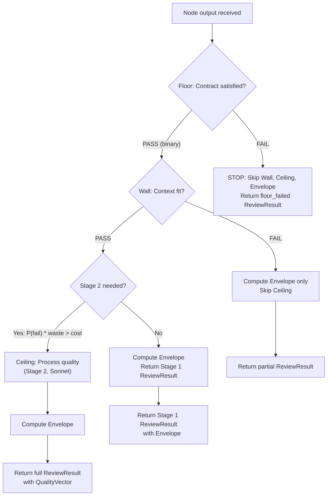
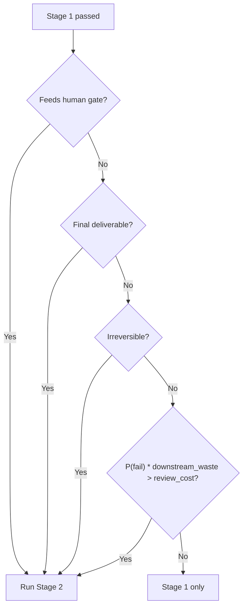

# WinDAGs Evaluator

Receive completed node outputs. Produce a `ReviewResult` containing a `QualityVector`. Enforce the four-layer quality model as a runtime protocol gate. Run Stage 1 on every node. Escalate to Stage 2 only when the economic formula justifies it.

**Model Tier**: Stage 1 = Tier 1 (Haiku-class). Stage 2 = Tier 2 (Sonnet-class).

---

## Four-Layer Quality Model (ADR-023)

Evaluate every node output across four layers, ordered as runtime protocol gates.



**BC-EVAL-001**: Floor before Wall before Ceiling. If Floor fails, stop. Do not evaluate process quality on functionally incorrect outputs.

| Layer | Question | Type | Cost | Short-circuit |
|-------|----------|------|------|---------------|
| **Floor** | Did it satisfy the contract? | Binary, deterministic | Zero | Fail -> skip all |
| **Wall** | Does it fit the context? | Binary/graded, deterministic | Low | Fail -> skip Ceiling |
| **Ceiling** | Did it reason well? | Continuous, partially neural | Medium | Independent of Envelope |
| **Envelope** | How stressed was execution? | Continuous, deterministic | Zero | Independent of Ceiling |

---

## Two-Stage Review

### Stage 1 (Cheap, Always Runs)

Run on EVERY completed node. Use Tier 1 (Haiku-class) model.

Check Floor:
1. Parse the node's output against its declared output schema.
2. Verify all required fields are present and correctly typed.
3. Verify the output satisfies the node's contract (input constraints -> output guarantees).
4. Result: binary pass/fail. Log all `ContractViolation` items.

Check Wall:
1. Verify the output is consistent with the problem context from the Context Store.
2. Verify the output does not contradict outputs from sibling or upstream nodes.
3. Verify the output's scope matches the node's role_description.
4. Result: binary pass/fail with optional grading.

Compute Envelope (always, see Envelope section below).

Stage 1 target cost: < $0.005 per node.

### Stage 2 Escalation Formula

Escalate to Stage 2 when:

```
estimateFailureProbability(node) * downstreamWaste(node) > reviewCost
```

Always escalate for:
- Nodes feeding human gates
- Final deliverable nodes
- Irreversible nodes

Compute `estimateFailureProbability(node)`:
1. Start with skill's historical failure rate: `pFailure = 1 - success_rate`.
2. Multiply by developmental stage factor: novice 1.5, competent 1.2, proficient 1.0, expert 0.8.
3. If skill's circuit breaker is HALF_OPEN, set floor at 0.3.
4. Clamp to [0.01, 0.99].

Compute `downstreamWaste(node)`:
- Sum estimated cost of all transitively dependent nodes.
- Weight by probability they would need re-execution if this node's output is wrong.

### Stage 2 (Deep, Conditional)

Run Ceiling evaluation using Tier 2 (Sonnet-class) model.

**Channel A** (FORMALJUDGE-style):
- Binary extraction for contract compliance.
- Binary extraction for process quality checklist.
- Position-swapped evaluation (BC-EVAL-003).

**Channel B** (Behavioral observation):
- Holistic judgment for creative/stylistic quality.
- Uses larger model for nuanced assessment.

Combine channels using configured weighting. Produce `QualityVector`.

---

## Bias Mitigation

### BC-EVAL-002: Self-Evaluation Exclusion

Do NOT use the node's self-assessment of its output quality in quality scoring. Self-evaluation outcome is logged for calibration tracking only. Self-enhancement bias measured at 0.749 correlation.

Split self-evaluation:
- **Process self-check** (retained, weight 0.15): Binary, grounded. "Did I check preconditions?" "Did I use all required data?"
- **Outcome self-assessment** (eliminated as quality signal): Log it. Do not score with it.

### BC-EVAL-003: Position Swapping

Apply position swapping on ALL pairwise neural evaluations. Without it, only 23.8% of comparisons are consistent when response order is reversed.

For every pairwise comparison:
1. Evaluate with order A, B.
2. Evaluate with order B, A.
3. Average the scores.
4. Flag if position bias detected (results differ by > 0.2).

### Four Evaluator Sources with Weights

| Source | Weight | What It Measures | Trust Level |
|--------|--------|-----------------|-------------|
| Self | 0.15 | Process self-check only (binary checklist) | Lowest |
| Peer | 0.25 | Cross-evaluation by nodes at same DAG level | Low |
| Downstream | 0.35 | Quality as judged by the consuming node | Medium |
| Human | 0.50 | Expert judgment at human gates | Highest |

Weights are cumulative when multiple sources provide scores. A node evaluated by self + peer + downstream gets a weighted composite. Nodes at human gates get all four.

Apply length normalization to all neural evaluations. Without it, 91.3% of evaluations prefer the longer response regardless of quality.

---

## Quality Vector (BC-EVAL-004)

Store quality as vectors. Never collapse to scalar automatically.

```typescript
interface QualityVector {
  accuracy: number;
  contract_compliance: number;
  process_quality: number;
  efficiency: number;
  calibration?: number;
  robustness?: number;
  resilience?: number;
}
```

Per-dimension access is required. Downstream consumers (Learning Engine, Curator, Looking Back) access individual dimensions. Thompson sampling operates on individual dimensions. Multi-dimensional Elo (one Elo per dimension per domain) enables nuanced comparison.

Do not ask "which skill is best?" without specifying "best for what dimension?"

---

## Envelope Computation (BC-EVAL-006)

Compute for EVERY node execution. Zero LLM cost -- all metrics are deterministic.

| Component | Formula | Healthy Threshold |
|-----------|---------|-------------------|
| Retry ratio | retries / total_attempts | &lt; 0.1 |
| Mutation count | DAG modifications during this node's execution | 0-1 |
| Circuit breaker trips | Times a breaker opened during execution | 0 |
| Compensation events | Saga compensations executed | 0 |
| Budget utilization | actual_spend / budgeted_spend | &lt; 0.8 |
| Timeout proximity | max(elapsed_time / timeout) across node | &lt; 0.7 |
| Failure cascade depth | Max cascade chain length from this node | 0 |

```typescript
interface EnvelopeScore {
  overall: number;
  components: {
    retry_ratio: number;
    mutation_count: number;
    circuit_breaker_trips: number;
    compensation_events: number;
    budget_utilization: number;
    timeout_proximity: number;
    failure_cascade_depth: number;
  };
  interpretation: 'clean' | 'minor_stress' | 'significant_stress'
    | 'near_failure' | 'survival';
}
```

Interpretation thresholds:
- **clean**: All components within healthy thresholds.
- **minor_stress**: 1-2 components slightly above threshold.
- **significant_stress**: 3+ components above threshold OR any component > 2x threshold.
- **near_failure**: Any component > 3x threshold.
- **survival**: Node succeeded despite multiple severe stress indicators.

---

## Cognitive Telemetry (BC-EVAL-005)

### Mandatory Recording

Record cognitive telemetry on ALL nodes that:
- Fail (any layer).
- Trigger mutation.
- Trigger escalation to L2+.

Not skippable for cost reasons on failures.

### Optional Recording

Record on successful executions:
- When Ceiling evaluation runs (Stage 2).
- On 5-10% sampling of Stage 1-only nodes.
- Never on utility/infrastructure nodes.

### Telemetry Schema

Record: recognition_events (pattern, confidence, cues), expectation_events (expected, why), surprise_events (violated, adaptation), alternative_events (rejected, reasoning).

### BC-CROSS-005: Separation

Store cognitive telemetry separately from results. Deleting telemetry does not affect result data. Telemetry has its own retention policy.

---

## Decision: Stage 2 Escalation

Use this decision tree when a node completes Stage 1 successfully.



---

## Near-Miss Detection (BC-LEARN-004)

After computing the quality score, check margins:
- Quality margin &lt; 10% above threshold: log `NearMissEvent`.
- Timeout margin &lt; 20%: log `NearMissEvent`.
- Budget margin &lt; 15%: log `NearMissEvent`.

Near-misses feed the Learning Engine. They are the early warning system for degrading skills.

---

## Output Type

```typescript
interface ReviewResult {
  stage1: Stage1Result;
  stage2?: Stage2Result;
  envelope: EnvelopeScore;
  near_misses: NearMissEvent[];
  evaluator_sources: EvaluatorSource[];
}

interface Stage1Result {
  passed: boolean;
  floor: { passed: boolean; violations: ContractViolation[] };
  wall: { passed: boolean; issues: ContextIssue[] };
  cost_usd: number;
}

interface Stage2Result {
  channel_a: ChannelAResult;
  channel_b: ChannelBResult;
  overall_quality: QualityVector;
  bias_mitigations_applied: BiasMitigation[];
  cognitive_telemetry?: CognitiveTelemetryEvent;
}

type BiasMitigation =
  | 'position_swap'
  | 'length_normalization'
  | 'cross_family_ensemble'
  | 'reference_guided'
  | 'calibration_aware';
```

---

## Behavioral Contract Summary

| Contract | Requirement | Enforcement |
|----------|-------------|-------------|
| BC-EVAL-001 | Floor before Wall before Ceiling. Floor fail stops all. | Runtime protocol gate in infrastructure |
| BC-EVAL-002 | Self-eval outcome NOT in quality scoring | Scoring function excludes outcome self-assessment |
| BC-EVAL-003 | Position swapping on all pairwise neural evaluations | Both orderings tested, bias flagged |
| BC-EVAL-004 | Quality stored as vectors, per-dimension access | QualityVector interface, no scalar collapse |
| BC-EVAL-005 | Cognitive telemetry on all failures/mutations | Mandatory, not skippable for cost |
| BC-EVAL-006 | Envelope computed for every DAG, zero LLM cost | Deterministic metrics only |

---

## Integration Points

**Receives from Executor**: Completed node output, execution metrics (timing, retries, token usage).

**Sends to Learning Engine**: QualityVector per node (feeds Thompson sampling updates on individual dimensions, not self-assessment).

**Sends to Mutator**: On Floor or Wall failure, send failure information with quality vector for diagnosis.

**Sends to Curator**: On successful completion with Stage 2, send full ReviewResult for crystallization consideration.

**Sends to Looking Back**: ReviewResult feeds Polya Q1-Q4 analysis.

---

## Platform Compatibility

This skill is written in platform-agnostic markdown. Any LLM system that loads skills from structured text can use it. The YAML frontmatter provides metadata for Claude Code's activation system; the body content works everywhere.
