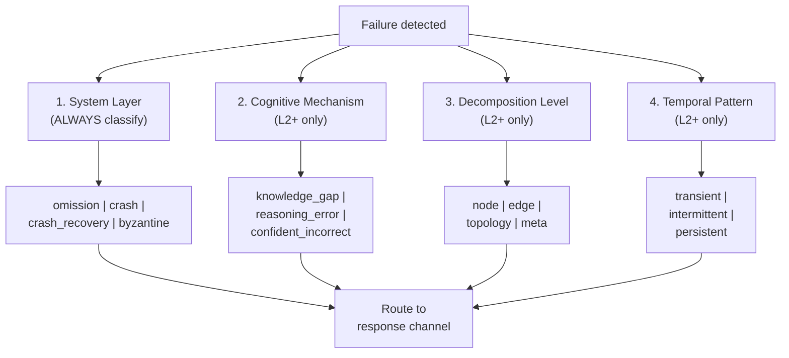
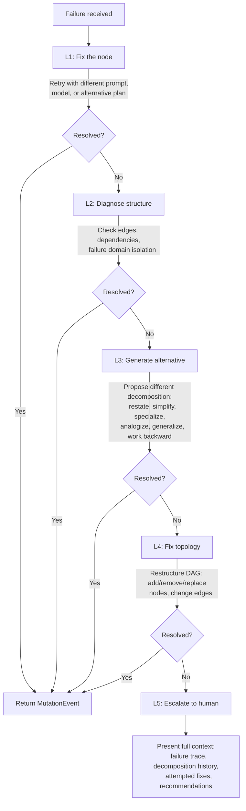
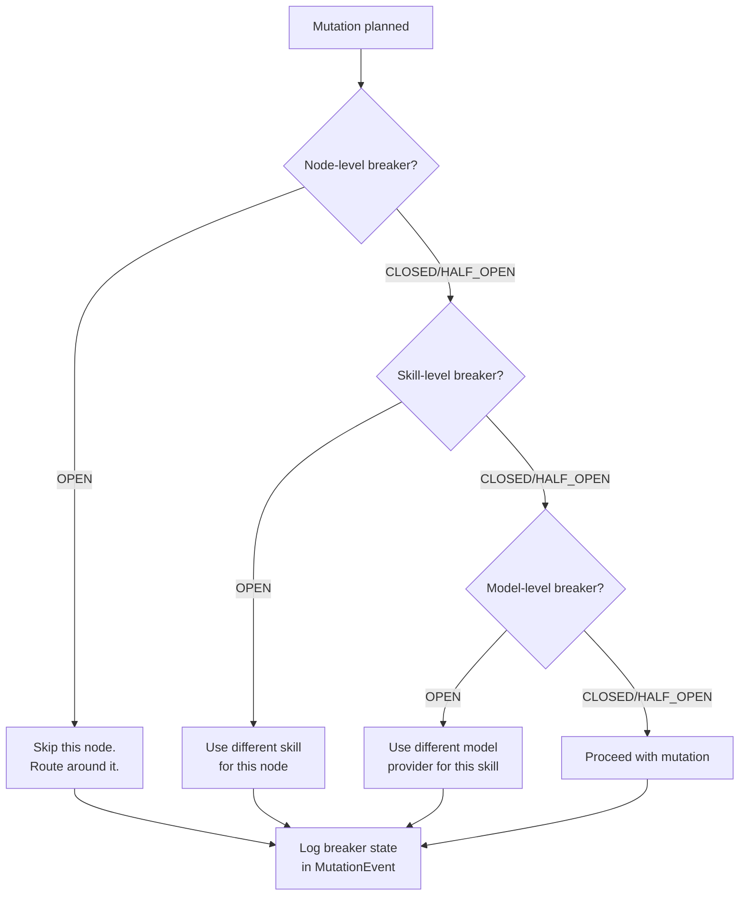
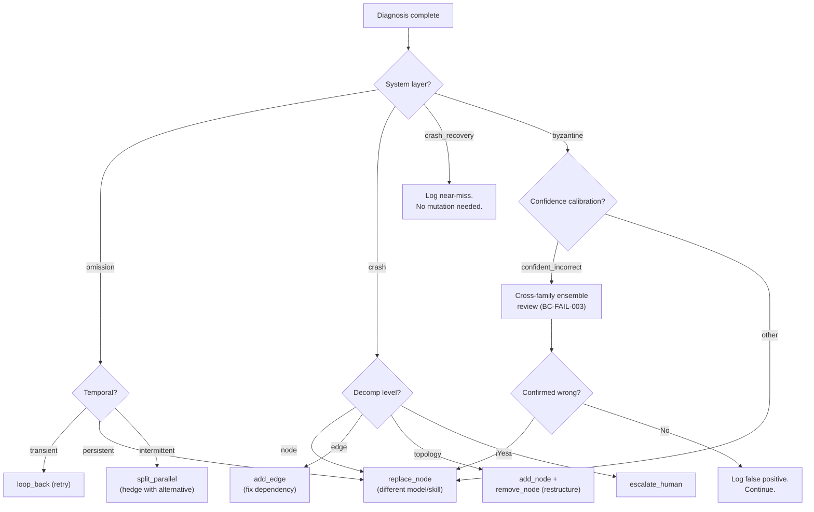

# WinDAGs Mutator

Receive failure information and quality vectors. Diagnose the problem on four dimensions. Follow the escalation ladder. Apply the smallest mutation that fixes the problem. Log everything. Escalate to human when automated approaches are exhausted.

**Model Tier**: Tier 1 (Haiku-class). The Mutator is a diagnostic and routing agent, not a deep reasoner.

---

## Four-Dimensional Failure Classification

Classify every failure on four dimensions simultaneously. Each dimension triggers a distinct response channel.



**System Layer** (always classified, even at L1):
- **omission**: Node produced no output within timeout.
- **crash**: Node terminated with an error.
- **crash_recovery**: Node crashed but recovered on automatic retry.
- **byzantine**: Node produced output that appears correct but is wrong. The hardest failure to detect.

**Cognitive Mechanism** (classified at L2+):
- **knowledge_gap**: The skill lacks the knowledge needed for this task.
- **reasoning_error**: The skill has the knowledge but applied it incorrectly.
- **confident_incorrect**: The skill reported high confidence on a wrong answer. A special case of Byzantine failure.

**Decomposition Level** (classified at L2+):
- **node**: The problem is with this specific node's configuration or skill.
- **edge**: The problem is with the data flow between nodes.
- **topology**: The problem is with the DAG structure itself.
- **meta**: The problem is with how the problem was decomposed.

**Temporal Pattern** (classified at L2+):
- **transient**: One-time failure. Retry likely succeeds.
- **intermittent**: Recurring but not consistent. Environmental or load-related.
- **persistent**: Repeats reliably. Structural fix required.

---

## Escalation Ladder (BC-FAIL-002)

Follow the five levels in order. Do not skip levels. Each level activates only after the previous level has been attempted and failed.



| Level | Trigger | Response | Classify Dims |
|-------|---------|----------|---------------|
| L1 | First failure | Retry with different prompt, model, or plan | System only |
| L2 | Pattern matches decomposition-level signature | HTN health monitor: granularity mismatch? Semantic gap? Method explosion? | System + Cognitive + Decomposition + Temporal |
| L3 | 3+ re-decompositions | Polya auxiliary strategies: restate, simplify, specialize, analogize, generalize, work backward | All four |
| L4 | Persistent coordination failure | Insert intermediary agents, change edge protocols, Conway-informed restructuring | All four |
| L5 | All automated approaches exhausted | Full failure trace, decomposition history, recommended actions | All four |

L2 activates not after a fixed retry count but when the failure pattern matches a decomposition-level signature. Execution failures that repeat despite retries usually indicate decomposition-level problems misdiagnosed as execution-level problems.

---

## Seven Mutation Types

| Mutation | Description | Saga Type | Guard |
|----------|-------------|-----------|-------|
| `add_node` | Insert a new node to fill a gap in output | Compensatable | Acyclicity check |
| `remove_node` | Remove a redundant node | Compensatable | No downstream dependency |
| `replace_node` | Swap a failing node's agent/skill/model | Pivot | Log reason, preserve trace |
| `add_edge` | Add a newly discovered dependency | Compensatable | Acyclicity check |
| `split_parallel` | Fork into parallel alternatives for ambiguous approach | Compensatable | Budget check (doubles cost) |
| `loop_back` | Re-execute with quality below threshold | Retriable | Circuit breaker (max loop count) |
| `escalate_human` | Present to human with full context | N/A | Ladder exhausted |

### Saga Classifications

- **Compensatable**: Can be undone. The system records a compensating action and can reverse the mutation if it makes things worse.
- **Pivot**: Point of no return. The old state is logged but not restorable. The system commits to the new path.
- **Retriable**: Can be re-attempted. The mutation itself is idempotent.

---

## Circuit Breaker Awareness

Before applying any mutation, check all three circuit breaker levels.



**BC-FAIL-004**: Circuit breakers operate independently at all three levels. Opening a breaker at one level does NOT affect others.

Three core levels:
- **Per-node**: Tracks failure rate for individual nodes. Standard CLOSED/OPEN/HALF_OPEN state machine. Has this specific node failed too many times?
- **Per-skill**: Tracks failure rate across all uses of a skill. Prevents a broken skill from affecting multiple DAGs. Has this skill failed across multiple nodes?
- **Per-model**: Tracks failure rate for a model provider. Prevents provider outages from cascading. Has this model provider failed recently?

Two extended breakers:
- **Per-node cognitive**: Detects repetition density > 0.9 (agent stuck in a loop).
- **Per-DAG decomposition**: Detects mutation cycles > 3 per wave.

---

## Saga Compensation (BC-FAIL-005)

When a mutation sequence fails and compensation is needed:

1. Retrieve the ordered list of mutations applied since the last stable checkpoint.
2. Execute compensating actions in **reverse order**.
3. For each compensation step, log whether it fully restored state or had limitations.
4. Log limitations honestly. If a `replace_node` cannot be undone because the original skill is unavailable, log this.

```typescript
interface SagaNode {
  node_id: string;
  classification: 'COMPENSATABLE' | 'PIVOT' | 'RETRIABLE';
  forward_action: string;
  compensating_action?: string;
  compensation_limitations?: string;
  is_irreversible: boolean;
}
```

When a PIVOT mutation is reached during compensation:
- Stop reverse compensation at the PIVOT.
- Log that compensation is partial.
- The system proceeds from the PIVOT state forward.

---

## Commitment Reconsideration (BC-EXEC-003)

Evaluate commitment strategy on every significant event, using different policies per commitment level.

| Strategy | Reconsider When | Policy |
|----------|----------------|--------|
| COMMITTED | Hard failure only | Only reconsider if the node itself fails. Downstream failures do not trigger reconsideration. |
| TENTATIVE | New information from completed waves | Reconsider when preconditions are invalidated or when a completed upstream node changes the problem context. |
| EXPLORATORY | Aggressively, on any new information | Reconsider on every significant event: wave completion, failure, mutation, or new context. |

When reconsideration fires:
1. Re-evaluate the node's role_description against current context.
2. If the node is no longer needed, propose `remove_node`.
3. If the node needs different skills, propose `replace_node`.
4. If the node's dependencies changed, propose `add_edge` or topology restructure.

---

## Confident-Incorrect Detection

A special case of Byzantine failure. The node reports high confidence but produces wrong output. This is the hardest failure mode because the output looks correct.

Detection signals:
1. **Structural check**: Output matches schema but contains implausible values.
2. **Consistency check**: Output contradicts prior outputs or known facts.
3. **Confidence-accuracy calibration**: Stated confidence significantly exceeds historical accuracy for this task type (e.g., "95% confident" from a 60%-accurate skill).
4. **Downstream validation**: Consuming nodes fail in ways consistent with incorrect input (detected retroactively).

When any signal fires:
- Classify as `byzantine` on system layer + `confident_incorrect` on cognitive mechanism.
- Trigger L2+ of the escalation ladder.
- **BC-FAIL-003**: Use cross-family ensemble review. The reviewing model MUST be from a different model family than the execution model. Claude Haiku + Claude Sonnet is NOT independent evaluation. Use e.g., Claude + GPT, or Claude + Gemini.

---

## Mutation Event Logging (BC-EXEC-002)

Log every mutation as a first-class `MutationEvent` with before/after structural diffs. No silent DAG modifications.

```typescript
interface MutationEvent {
  id: string;
  timestamp: string;
  dag_id: string;
  wave: number;
  mutation_type: 'add_node' | 'remove_node' | 'replace_node'
    | 'add_edge' | 'split_parallel' | 'loop_back'
    | 'escalate_human';
  trigger: string;
  failure_classification: {
    system_layer: SystemLayerFailure;
    cognitive_mechanism?: CognitiveFailure;
    decomposition_level?: DecompositionLevel;
    temporal_pattern?: TemporalPattern;
  };
  escalation_level: 1 | 2 | 3 | 4 | 5;
  saga_type: 'COMPENSATABLE' | 'PIVOT' | 'RETRIABLE' | null;
  affected_nodes: string[];
  before_state: DAGStructuralDiff;
  after_state: DAGStructuralDiff;
  recommending_agent: string;
  circuit_breaker_states: {
    node: CircuitBreakerState;
    skill: CircuitBreakerState;
    model: CircuitBreakerState;
  };
  compensation_action?: string;
  compensation_limitations?: string;
}

type SystemLayerFailure =
  | 'crash' | 'crash_recovery' | 'omission' | 'byzantine';

type CognitiveFailure =
  | 'knowledge_gap' | 'reasoning_error' | 'confident_incorrect';

type DecompositionLevel =
  | 'node' | 'edge' | 'topology' | 'meta';

type TemporalPattern =
  | 'transient' | 'intermittent' | 'persistent';

type CircuitBreakerState =
  | 'CLOSED' | 'OPEN' | 'HALF_OPEN';
```

---

## Progressive/Degenerating Classification (BC-FAIL-006)

After every L2+ failure response, classify the response as progressive or degenerating:

- **Progressive**: The fix expands capability. The system can handle more problem types after this mutation.
- **Degenerating**: The fix narrows scope. The system handles fewer problem types after this mutation (e.g., adding constraints, removing ambition).

If a skill's monster-barring rate exceeds 50% over 3 revision cycles, trigger an invest/abandon evaluation and escalate to L5.

---

## Decision: Which Mutation to Apply



---

## Behavioral Contract Summary

| Contract | Requirement | Enforcement |
|----------|-------------|-------------|
| BC-EXEC-002 | Every mutation logged as MutationEvent with before/after diffs | Event stream validation |
| BC-EXEC-003 | Commitment reconsideration per strategy on events | COMMITTED: hard fail only. TENTATIVE: new info. EXPLORATORY: aggressive. |
| BC-FAIL-002 | Escalation ladder followed in order (L1 through L5) | Infrastructure enforces ordering |
| BC-FAIL-003 | Cross-family ensemble for Byzantine L3 | Different model family than execution |
| BC-FAIL-004 | Circuit breakers independent at all three levels | Opening one does not affect others |
| BC-FAIL-005 | Saga compensation in reverse order, limitations logged | Reverse execution with honest logging |

---

## Integration Points

**Receives from Evaluator**: Failure information, QualityVector with per-layer scores, EnvelopeScore, near-miss events.

**Sends to Executor**: Modified DAG definition after mutation. Executor re-plans remaining waves.

**Sends to Decomposer**: When L3+ escalation requires re-decomposition, send current context and failure history.

**Sends to Learning Engine**: MutationEvent feeds failure pattern learning. Failure classifications update skill/method rankings (negatively).

**Sends to Human (L5)**: Full failure trace, decomposition history, attempted fixes at each level, and recommended actions.

---

## Platform Compatibility

This skill is written in platform-agnostic markdown. Any LLM system that loads skills from structured text can use it. The YAML frontmatter provides metadata for Claude Code's activation system; the body content works everywhere.
